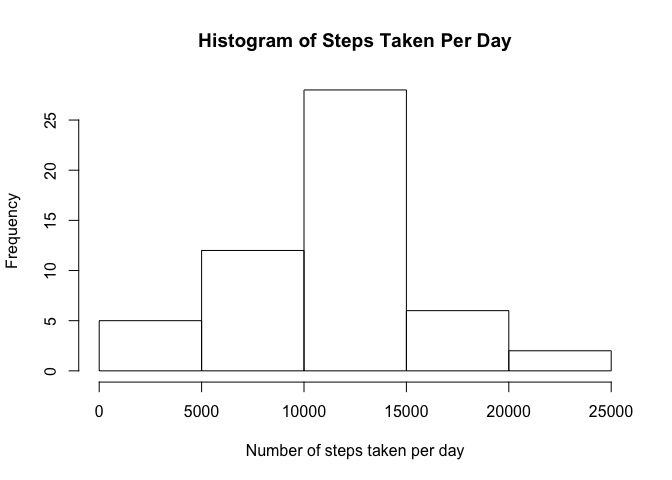
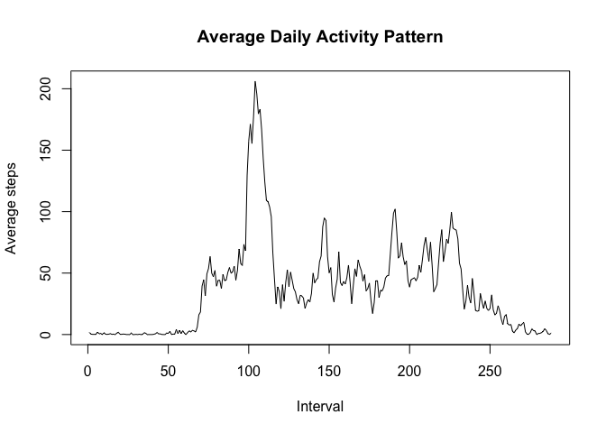
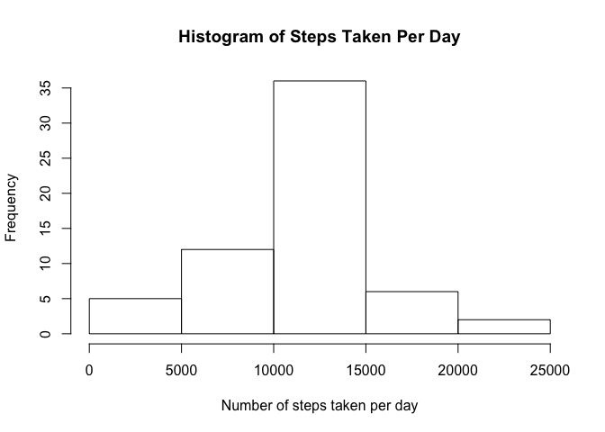
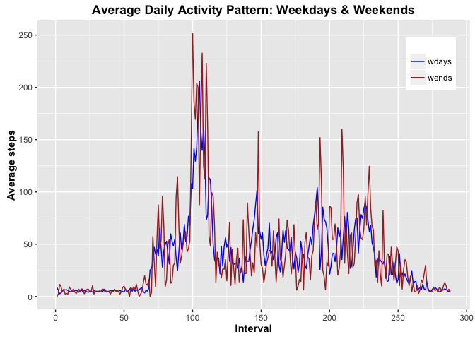

# Reproducible Research: Peer Assessment 1

**1. Code for reading the dataset and processing the data**

Setting up environment

```r
rm(list = ls())
library("data.table")
library("dplyr")
library("timeDate")
library("ggplot2")
setwd("~/GitHub/05_ReproducableResearch/RepData_PeerAssessment1")
```

Loading data

```r
f <- file.path(getwd(), "activity.zip") %>% unzip()
DT_activity <- data.table(read.csv(file.path(getwd(), "activity.csv")))
```
Making `interval` an index from `1:288` to number the 5-minute intervals in a day.

```r
DT_activity[, `:=`(interval, c(1:288))]
```


**2. Histogram of the total number of steps taken per day**

Manipulating data

```r
DT_activity <- group_by(DT_activity, date)  #group data
DT_totalSteps <- summarise(DT_activity, sum(steps)) %>% setnames(c("date", "totalSteps"))
summarise(ungroup(DT_activity), sum(steps))  #ungroup data
```

```
## Source: local data table [1 x 1]
## 
##   sum(steps)
##        (int)
## 1         NA
```

Creating plot

```r
with(DT_totalSteps, hist(totalSteps, main = "Histogram of Steps Taken Per Day", 
    xlab = "Number of steps taken per day"))
```

\
**3. Mean and median of the total number of steps taken per day**

```r
summarise(DT_totalSteps, mean(totalSteps, na.rm = T), median(totalSteps, na.rm = T)) %>% 
    setnames(c("mean", "median")) %>% data.table()
```

```
##        mean median
## 1: 10766.19  10765
```
**4. Time series plot of the average number of steps taken**

Calculating the mean steps taken by interval

```r
DT_activity <- group_by(DT_activity, interval)  #group data
summarise(DT_activity, mean(steps)) %>% setnames(c("interval", "averageSteps")) %>% 
    head(3)
```

```
##   interval averageSteps
## 1        1           NA
## 2        2           NA
## 3        3           NA
```
Note the values for `mean(steps)` are all NA. This tells us there is at least one incomplete case within each interval. To deal with this we specify `na.rm=TRUE` within the call to `mean()`.

```r
DT_activityPattern <- summarise(DT_activity, mean(steps, na.rm = TRUE)) %>% 
    setnames(c("interval", "averageSteps"))
head(DT_activityPattern, 3)
```

```
##   interval averageSteps
## 1        1    1.7169811
## 2        2    0.3396226
## 3        3    0.1320755
```

```r
summarise(ungroup(DT_activity), mean(steps))  #ungroup data
```

```
## Source: local data table [1 x 1]
## 
##   mean(steps)
##         (dbl)
## 1          NA
```
Creating time-series plot 

```r
with(DT_activityPattern, plot(interval, averageSteps, main = "Average Daily Activity Pattern", 
    xlab = "Interval", ylab = "Average steps", type = "l"))
```

\
**5. The 5-minute interval that, on average, contains the maximum number of steps**

Calculating the max of `averageSteps` and the interval at which it occurs

```r
summarize(DT_activityPattern, which.max(averageSteps), max(averageSteps)) %>% 
    setnames(c("interval", "max")) %>% data.table()
```

```
##    interval      max
## 1:      104 206.1698
```
**6. Code to describe and show a strategy for imputing missing data**

Counting the number of rows that have missing data

```r
summarize(DT_activity, sum(is.na(steps))) %>% setnames(c("NAs")) %>% data.table()
```

```
##     NAs
## 1: 2304
```
Filling NA values with the mean

```r
for (col in c("steps")) DT_activity[is.na(get(col)), `:=`((col), mean(DT_activity$steps, 
    na.rm = TRUE))]
```
Verifying the NA values were filled

```r
summarize(DT_activity, sum(is.na(steps))) %>% setnames(c("NAs")) %>% data.table()
```

```
##    NAs
## 1:   0
```

**7. Histogram of the total number of steps taken each day after the missing data has been filled**

Manipulating data

```r
DT_activity <- group_by(DT_activity, date)  #group data
DT_totalSteps <- summarise(DT_activity, sum(steps)) %>% setnames(c("date", "totalSteps"))
summarise(ungroup(DT_activity), sum(steps))  #ungroup data
```

```
## Source: local data table [1 x 1]
## 
##   sum(steps)
##        (int)
## 1     655856
```
Creating plot

```r
with(DT_totalSteps, hist(totalSteps, main = "Histogram of Steps Taken Per Day", 
    xlab = "Number of steps taken per day"))
```

\
Calculating and reporting the mean and median of the total number of steps taken per day

```r
summarise(DT_totalSteps, mean(totalSteps), median(totalSteps)) %>% setnames(c("mean", 
    "median")) %>% data.table()
```

```
##        mean median
## 1: 10751.74  10656
```
**Mean and median of the total number of steps taken per day**

These values differ from the estimates from the first part of the assignment. The mean and median decreased by `14.45` steps and `109` steps, respectively. 

**8. Panel plot comparing the average number of steps taken per 5-minute interval accross weekdays and weekends**

Calculating mean steps taken by interval for weekdays and for weedends

```r
DT_activity <- DT_activity[,wday:=isWeekday(DT_totalSteps$date, wday=1:5)] #create wday variable
DT_wdays <- DT_activity[wday==TRUE] %>% #filter rows where wday==TRUE
  group_by(interval) %>% #group data
  summarise(mean(steps)) %>% #calculate mean steps by interval
  setnames(c("interval","averageSteps")) %>%
  setorder(interval)
DT_wends <- DT_activity[wday==FALSE] %>% #filter rows where wday==FALSE
  group_by(interval) %>% #group data
  summarise(mean(steps)) %>% #calculate mean steps by interval
  setnames(c("interval","averageSteps")) %>%
  setorder(interval)
```
Creating panel plot

```r
ggplot(DT_wdays,aes(interval,averageSteps)) + 
  geom_line(aes(color="wdays")) + 
  geom_line(data=DT_wends,aes(color="wends")) + 
  labs(list(x="Interval", y="Average steps")) + 
  scale_x_continuous(breaks=seq(0,300,50)) +
  scale_y_continuous(breaks=seq(0,250,50)) +
  scale_colour_manual("", breaks = c("wdays", "wends"), values = c("blue", "brown")) + 
  ggtitle("Average Daily Activity Pattern: Weekdays & Weekends") + 
  theme(plot.title = element_text(face="bold"),
        axis.title.x = element_text(face="bold"),
        axis.title.y = element_text(face="bold"),
        legend.position = c(.91, .85))
```

\
